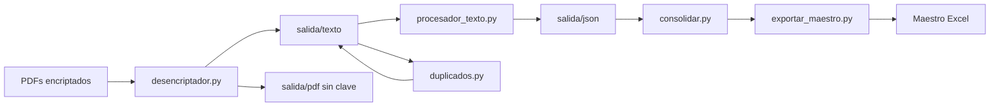

# Extractos Bancarios CO

Pipeline en Python para procesar extractos bancarios colombianos: desencriptar PDFs, extraer movimientos con parsers especializados por entidad y consolidar todo en un maestro Excel listo para contabilidad.

> **Portfolio project** — automatización de datos financieros personales reutilizable como herramienta open source.

## Problema

Los bancos colombianos (Nequi, Bancolombia, Nu, Falabella, etc.) publican extractos en PDF, muchas veces protegidos con contraseña y con formatos distintos. Consolidar movimientos para declaración de renta o envío a contador implica trabajo manual repetitivo.

Este proyecto automatiza el flujo completo: **PDF → texto → JSON estructurado → Excel maestro**, con deduplicación y soporte multi-banco.

## Características

- Desencriptación de PDFs y copias sin contraseña para compartir con contador
- Parsers determinísticos por entidad (sin depender de LLM para el flujo principal)
- Detección automática del formato según contenido y nombre de archivo
- Consolidación en `Maestro_Movimientos_Bancarios.xlsx` con hojas por año, resumen y gráficos
- Eliminación de documentos duplicados por hash de contenido
- Pipeline modular por CLI (`./run`, scripts en `scripts/`)

## Bancos soportados

| Entidad | Productos |
|---------|-----------|
| Nequi | Cuenta de ahorro |
| Bancolombia | Cuenta, tarjeta Mastercard, crédito, consolidado/comisiones |
| Nu | Cuenta, préstamo |
| Banco Falabella | Tarjeta y movimientos |
| Banco de Bogotá | Cuenta de ahorros |
| Cooperativa | Recibos de aporte |
| Addi | Extractos de crédito |
| RappiPay | Resumen de cuenta |
| Protección | Pensiones obligatorias |

## Arquitectura



## Stack

- Python 3.11+
- [pypdf](https://pypi.org/project/pypdf/) — lectura y desencriptación de PDFs
- [openpyxl](https://pypi.org/project/openpyxl/) — generación del Excel maestro
- Parsers con expresiones regulares (sin ML en el flujo principal)
- Ollama opcional para formatos no cubiertos (`procesador_ollama.py`)

## Inicio rápido

### 1. Clonar e instalar

```bash
git clone https://github.com/KrKrypton/extractos-bancarios-co.git
cd extractos-bancarios-co
python -m venv .venv
source .venv/bin/activate
pip install -r requirements.txt
```

### 2. Demo sin datos reales

```bash
.venv/bin/python scripts/ejecutar_demo.py
.venv/bin/python -m unittest tests/test_ejemplos.py
```

Genera JSON y un maestro de ejemplo en `salida/` usando archivos sintéticos en `ejemplos/texto/`.

### 3. Procesar tus extractos

Coloca los PDFs en `Extractos_Bancarios/YYYY-MM/` y define las contraseñas:

```bash
cp .env.example .env   # editar con tus claves
export CONTADORA_PDF_PASSWORDS="cedula,otra_clave"

./run --solo-texto                              # PDF → texto (+ PDF sin clave)
.venv/bin/python scripts/procesar_textos_local.py  # texto → JSON
.venv/bin/python exportar_maestro.py            # JSON → Excel maestro
```

### 4. Limpiar duplicados

```bash
.venv/bin/python scripts/limpiar_duplicados.py          # simulación
.venv/bin/python scripts/limpiar_duplicados.py --ejecutar
```

## Estructura del proyecto

```
├── procesar.py              # Pipeline principal
├── desencriptador.py        # PDF → texto
├── procesador_texto.py      # Parsers por banco
├── exportar_maestro.py      # Excel consolidado
├── duplicados.py            # Detección/eliminación de duplicados
├── maestro_workbook.py      # Formato del Excel
├── scripts/                 # Utilidades CLI
├── ejemplos/texto/          # Datos sintéticos para demo
├── Extractos_Bancarios/     # Entrada (PDFs locales, no en git)
└── salida/                  # Salida generada (no en git)
```

## Privacidad

**Nunca subas PDFs, extractos ni el Excel maestro con datos reales.** El `.gitignore` excluye `Extractos_Bancarios/**/*.pdf`, `salida/` y archivos `.xlsx`. Las contraseñas van en variables de entorno (ver `.env.example`).

## Licencia

MIT — ver [LICENSE](LICENSE).
